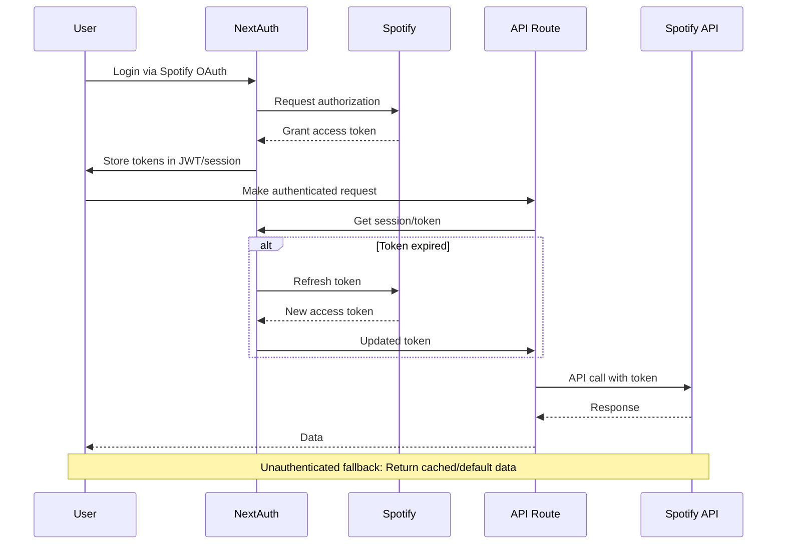

# Spotify API Authentication Flow Plan

## Overview
This plan outlines the integration of Spotify API authentication within the existing NextAuth setup. It leverages NextAuth's JWT and session management to handle Spotify access tokens, refresh logic, and error handling. The flow ensures secure token storage, automatic refresh, fallback mechanisms for unauthenticated requests, and rate limiting compliance.

## Authentication Flow Diagram

## Token Access and Refresh in API Routes

### Accessing Tokens
- API routes use `getServerSession` from NextAuth to retrieve the session.
- Extract `accessToken`, `refreshToken`, and `expiresAt` from the session.
- Check if `expiresAt` is within a buffer (e.g., 5 minutes) before expiration.
- If expired or near expiry, trigger refresh logic.

### Refresh Logic
- Use Spotify's refresh token endpoint: `POST https://accounts.spotify.com/api/token` with `grant_type=refresh_token`.
- Include `refresh_token` and base64-encoded `client_id:client_secret` in Authorization header.
- On success, update JWT with new `access_token`, `refresh_token` (if provided), and new `expires_at`.
- Handle cases where refresh fails (e.g., revoked token) by redirecting to re-authentication.

### Implementation in API Routes
- Create a utility function `getSpotifyToken(session)` that handles token retrieval and refresh.
- Wrap Spotify API calls with this utility to ensure valid tokens.
- Store refreshed tokens back to the session/JWT via NextAuth callbacks.

## Handling Unauthenticated Requests with Fallbacks

### Detection
- Check if session exists and contains valid Spotify tokens.
- If no session or tokens, treat as unauthenticated.

### Fallback Mechanisms
- **Public Data**: For endpoints like public playlists or search, return cached or default data without authentication.
- **Limited Functionality**: Provide basic features (e.g., browse public content) with clear indicators for premium features.
- **Graceful Degradation**: Display user-friendly messages like "Sign in with Spotify for personalized recommendations."
- **Caching Layer**: Use Redis or in-memory cache for frequently accessed public data to reduce API dependency.

### User Experience
- Redirect unauthenticated users to login page for restricted actions.
- Show login prompts in UI components without disrupting navigation.

## Rate Limiting Management

### Spotify API Limits
- Standard rate limit: 25 requests per 30 seconds for most endpoints.
- Higher limits for some endpoints (e.g., 100 for search).
- Burst limits and daily caps may apply.

### Implementation Strategy
- **Client-Side Throttling**: Use libraries like `lodash.throttle` for UI interactions.
- **Server-Side Rate Limiting**: Implement middleware to track requests per user/IP.
- **Queue System**: For high-volume operations, queue requests and process them sequentially.
- **Caching**: Cache responses to minimize API calls (e.g., user library data for 5-10 minutes).
- **Exponential Backoff**: On 429 errors, implement retry logic with increasing delays.

### Monitoring
- Log rate limit headers from Spotify responses (`X-RateLimit-*`).
- Alert when approaching limits to prevent service disruption.

## Token Security Considerations

### Storage
- Tokens stored securely in HTTP-only, secure cookies via NextAuth.
- Never expose tokens in client-side code or logs.
- Use HTTPS in production to encrypt token transmission.

### Handling
- Validate tokens before use; reject malformed or expired ones.
- Implement token rotation on refresh to minimize exposure.
- Use environment variables for client credentials; never hardcode.

### Best Practices
- Implement CSRF protection for API routes.
- Regularly rotate `NEXTAUTH_SECRET`.
- Monitor for token leaks via logging and alerts.

## Error Handling

### Token-Related Errors
- **401 Unauthorized**: Trigger token refresh; if refresh fails, redirect to login.
- **403 Forbidden**: Check scopes; may require re-authentication with additional permissions.
- **429 Rate Limited**: Implement backoff and retry; inform user of temporary limitations.

### Network and API Errors
- **500 Internal Server Error**: Log details; return generic error to user.
- **Timeout**: Implement request timeouts (e.g., 10 seconds); retry or fallback.
- **Invalid Response**: Validate API responses; handle malformed data gracefully.

### User-Facing Errors
- Display clear, actionable error messages (e.g., "Please sign in again" for auth failures).
- Provide retry options for transient errors.
- Log errors for debugging without exposing sensitive information.

### Logging and Monitoring
- Use structured logging for all API interactions.
- Monitor error rates and token refresh success.
- Set up alerts for high error rates or authentication failures.

## Implementation Considerations

### Dependencies
- Ensure NextAuth v4+ for stable Spotify provider support.
- Add `spotify-web-api-node` or similar for API interactions if needed.

### Testing
- Unit tests for token refresh logic.
- Integration tests for full authentication flow.
- Mock Spotify API for testing error scenarios.

### Deployment
- Ensure environment variables are set securely in production.
- Update Spotify app redirect URIs for production domains.
- Monitor performance impact of token refresh on API response times.

This plan provides a comprehensive framework for secure, reliable Spotify API integration within the NextAuth ecosystem.